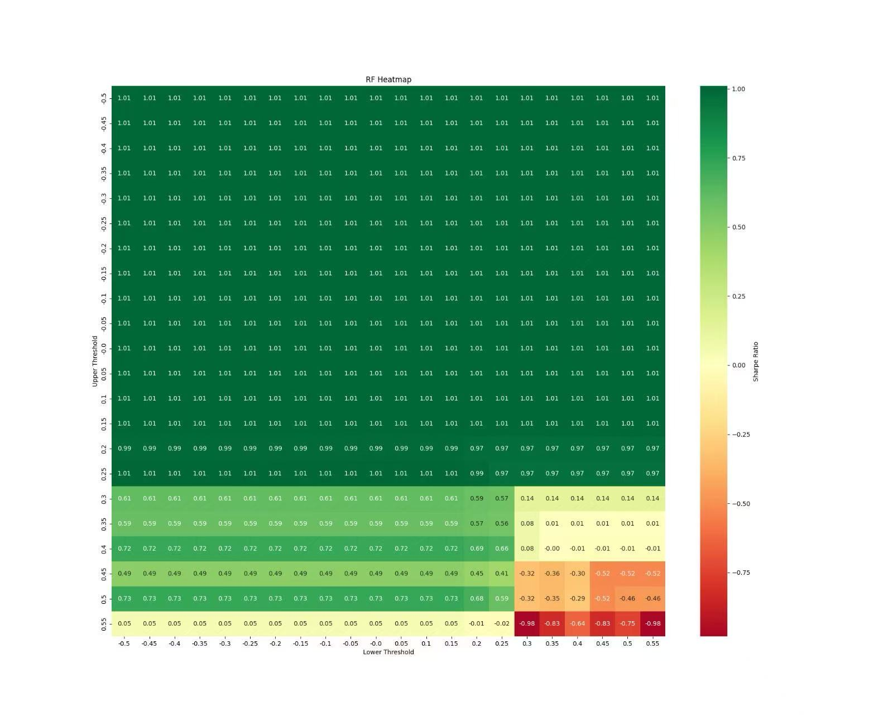

## Introduction: Diving Deeper

Welcome back! This is our second blog post documenting the journey of our FINA4350 group project: developing a Bitcoin trading strategy driven by sentiment analysis of CoinDesk news headlines. At the end of the course, we want to reflect on the *process*, particularly the technical hurdles and design choices encountered while building our sentiment prediction engine and backtesting framework.

This post looks under the hood, sharing the challenges we faced translating theory into code, and how we tackled them. We believe documenting this journey is crucial for learning and offers a different perspective than simply presenting the outcome.

## Part 1: Engineering the Sentiment Engine - Challenges & Design Choices

Our first major task was building a system to extract meaningful sentiment signals from raw news headlines. This involved more than just plugging data into libraries; it required careful consideration of data handling, feature engineering, and model selection within a time-series context.

### Challenge 1: Taming the Text Wild West

Financial news headlines aren't always perfectly structured. Our `preprocess_text` function implemented standard cleaning steps essential for reliable analysis:

* Converting text to lowercase (`text.lower()`).
* Removing punctuation (`text.translate(str.maketrans('', '', string.punctuation))`).
* Tokenizing text into words (`nltk.word_tokenize`).
* Removing common English stopwords (`nltk.corpus.stopwords.words('english')`).

These steps ensured a more consistent input for feature extraction. While we initially considered more complex cleaning (like handling potential HTML remnants), we focused on this standard pipeline for the core modeling process fed by the `get_daily_features` function.

**Why it Matters**: Garbage in, garbage out. Clean, standardized text is fundamental for meaningful feature generation and model performance.

### Design Choice: A Multi-Lens Approach to Sentiment (TextBlob & VADER)

We employed *both* TextBlob and VADER (`SentimentIntensityAnalyzer`) within our `get_daily_features` function to capture sentiment:

* **TextBlob:** Provided basic polarity and subjectivity scores (`TextBlob(art).sentiment`).
* **VADER:** Generated compound, positive, negative, and neutral scores (`sid.polarity_scores(art)`), specifically designed for shorter texts and potentially capturing nuances better.

**Our Rationale:** Combining signals from both aimed for a more robust sentiment measure. TextBlob offered a general view, while VADER provided intensity-aware scores. These scores (specifically TextBlob polarity and VADER compound) became direct inputs for some models.

**Reflection:** We recognized these lexicon-based tools have inherent limitations (e.g., nuanced financial jargon, difficulty with complex sentence structures) and viewed their outputs as potentially noisy signals rather than perfect ground truth.

### Design Choice: Varied Features for Different Models

We experimented with different feature sets for our machine learning models:

* **TextBlob's NaiveBayesAnalyzer:** We utilized TextBlob's built-in Naive Bayes sentiment analyzer (`TextBlob(art, analyzer=NaiveBayesAnalyzer())`). This approach directly calculates positive (`p_pos`) and negative (`p_neg`) probabilities based on TextBlob's pre-trained model, rather than training a new model on custom features. Our final 'NB' signal was the difference: `p_pos - p_neg`.
* **Lexicon Scores for Logistic Regression (LR) & K-Nearest Neighbors (KNN):**
  * For LR, we used TextBlob polarity, TextBlob subjectivity, and VADER compound scores as input features (`np.column_stack`).
  * For KNN, we used TextBlob polarity and VADER compound scores.
* **Word Frequency for Random Forest (RF):** Only for the Random Forest model did we use word frequency features derived from Scikit-learn's `CountVectorizer(max_features=100)`. This converted the preprocessed article text (`' '.join(art)`) into word count vectors (`word_features`), allowing the RF model to learn patterns directly from word usage (e.g., frequency of "rally", "crash").

**Target Variable:** For the supervised models (LR, RF, KNN), the target variable `y_train` was derived from the training data's TextBlob polarity scores: `np.array([1 if p >= 0.05 else 0 for p in features_train['tb_polarity']])`. The models were thus trained to predict whether the average sentiment polarity (via TextBlob) was likely to be positive ($\ge 0.05$) or not.

### Challenge 2: The Selection of features in Machine Learning Models

Initially, our logistic regression model and KNN used only TextBlob’s polarity score to predict the overall sentiment of news articles. Moreover, Due to the singular matrix issue of the logistic regression model and the complexity of regularization and bootstrapping in the classroom setting, we simplified the logistic regression model. We transitioned from a word-based feature approach to an article-based feature approach, and a similar simplication is applied to the random forest model.

However, high errors were observed for all the machine learning models. The Mean Absolute Error (MAE) of Naive Bayes, Logistic Regression, Random Forest and KNN were 0.46458, 0.25034, 0.20578 and 0.25183 respectively, and  their Root Mean-squared Error (RMSE) were 0.52180, 0.31043, 0.26212,	0.31482 respectively. Worse still, the optimal strategy based on shown in the heatmap did not outperform the benchmark strategy (i.e. a long position of BTC). The poor performance result reveals the critical shortcomings in our machine learning models, and the main issues might be particularly related with the feature selection process.



**Our Solution:** We made adjustments and feature enhancement of the Machine Learning Models

1. Incorporate additional features, such as the VADAR compound score for both logistic regression and KNN, and Textblob Subjectivity for logistic regression
2. For random forest model, we reintroduced word-level features but aggregated results at the article level to avoid matrix singularity issues.

#### **Code Snippet 1: Original version of Random Forest** *(Illustrative)*

```python
def random_forest(self, df, training_days, test_day):
    # Training data
    features_train = get_daily_features(df, training_days)
    X_train = np.column_stack([
        features_train['tb_polarity']
    ])
    y_train = np.array([1 if p >= 0.05 else 0 for p in features_train['tb_polarity']])
    self.models['random_forest'].fit(X_train, y_train)

    # Test data
    features_test = get_daily_features(df, [test_day])
    X_test = np.column_stack([
        features_test['tb_polarity'],
    ])

    # Predict
    probs = self.models['random_forest'].predict_proba(X_test)
    pos_prob = np.mean(probs[:, 1])
    neg_prob = np.mean(probs[:, 0])
  
    return {'positive_prob': pos_prob, 'negative_prob': neg_prob}
```

#### **Code Snippet 2: Updated version of Random Forest** *(Illustrative)*

```python
def random_forest(self, df, training_days, test_day):
    # Training data
    features_train = get_daily_features(df, training_days)
    if not features_train['articles'] or features_train['word_features'] is None:
        return {'positive_prob': 0.5, 'negative_prob': 0.5}
  
    vectorizer = features_train['vectorizer']
    X_train = features_train['word_features']
    y_train = np.array([1 if p >= 0.05 else 0 for p in features_train['tb_polarity']])
  
    # Train model
    self.models['random_forest'].fit(X_train, y_train)

    # Test data
    features_test = get_daily_features(df, [test_day], vectorizer=vectorizer)
    if not features_test['articles'] or features_test['word_features'] is None:
        return {'positive_prob': 0.5, 'negative_prob': 0.5}
  
    X_test = features_test['word_features']

    # Predict
    probs = self.models['random_forest'].predict_proba(X_test)
    pos_prob = np.mean(probs[:, 1])
    neg_prob = np.mean(probs[:, 0])
  
    return {'positive_prob': pos_prob, 'negative_prob': neg_prob}
```

**Result:** After refining the KNN, random forest, and logistic regression models through feature enhancement, all models exhibited improved accuracy. The Mean Absolute Error (MAE) of Naive Bayes, Logistic Regression, Random Forest and KNN became 0.46458, 0.15613, 0.16990 and 0.16283 respectively, and their Root Mean-squared Error (RMSE) were 0.52180, 0.19246, 0.21102,	0.20904 respectively.

### Challenge 3: Respecting Time - The Rolling Window

Financial data is inherently time-ordered. A simple train-test split invites lookahead bias and ignores potential changes in market dynamics (non-stationarity).

**Our Solution:** We implemented a rolling window approach in the main loop of `rolling_models.py`:

1. Define a lookback (training) period (`10` days in our script: `range(10, len(unique_days))` and `training_days = unique_days[i - 10:i]`).
2. Train the models (LR, RF, KNN) on data from the training window. (NB used TextBlob's analyzer on the test day directly).
3. Generate sentiment predictions/scores for the next day (`test_day = unique_days[i]`).
4. Roll the window forward by one day and repeat.

**Implementation Hurdle:** This retraining at each step is computationally more demanding than a single split but crucial for simulating a realistic learning process over time.

#### **Code Snippet 3: Conceptual Rolling Window Indices** *(Illustrative)*

Here’s a simplified conceptual Python snippet *(We will include the full script in the final project)*:

```python
import numpy as np

# This function illustrates how training/test indices are generated for each step.
# The actual implementation in rolling_models.py uses date strings directly.
def get_rolling_window_indices(data_length, window_size, forecast_horizon=1):
    indices = []
    for i in range(data_length - window_size - forecast_horizon + 1):
        train_indices = np.arange(i, i + window_size)
        test_indices = np.arange(i + window_size, i + window_size + forecast_horizon)
        indices.append((train_indices, test_indices))
    return indices

# Example:
total_days = 25
training_window = 10
rolling_indices = get_rolling_window_indices(total_days, training_window)
print(f"First window: Train indices {rolling_indices[0][0]}, Test indices {rolling_indices[0][1]}")
```

*Explanation:* This conceptual code shows how, at each step, we define a set of past days for training and the next day for testing (prediction). Our script uses lists of date strings (`training_days`, `test_day`) to slice the DataFrame accordingly.

#### Baseline: Pre-existing Coindesk Sentiment

Our dataset (`all_coindesk_news.csv`) included a column named 'sentiment'. We created a simple baseline signal using the `coindesk_score` function, which mapped 'POSITIVE' to 1, 'NEGATIVE' to -1, 'NEUTRAL' to 0, and calculated the daily average of this score. This provided a non-ML reference point.

## Part 2: Backtesting the Signals  - From Prediction to P&L

Generating daily sentiment scores (`models_results.csv`) was just the first step. We needed a framework (`Backtest.py`) to translate these scores into trading signals and rigorously evaluate their historical performance against Bitcoin price data (`BTC_1d_binance.csv`).

### Challenge 4: Defining the Trading Logic - Thresholds & Signal Inversion

How does a sentiment score (like the NB score `p_pos - p_neg`) trigger a trade? We used a threshold-based system defined in the `model_position` function:

* If `signal_col > threhold_tuple[0]` (upper threshold), take a short position (-1).
* If `signal_col < threhold_tuple[1]` (lower threshold), take a long position (+1).
* Otherwise, remain flat (0).

**The Hurdle:** Finding good thresholds requires testing. We explored different threshold pairs, using tools like the Sharpe Ratio heatmap generated by `plot_heatmap` (commented out in the final script run) to visualize performance across various upper/lower threshold combinations.

**Signal Inversion ("Momentum"):** The `model_position` function includes a `momentum` boolean flag. When `momentum=True`, the calculated position is inverted (`position_col = position_col * -1`). **Our Rationale/Use:** Instead of a traditional price momentum filter, we used this flag to test a *contrarian* application of the sentiment signal. If `momentum=True`, a positive sentiment signal (normally long) would trigger a short position, and vice-versa. This explores whether sentiment might be acting as a counter-indicator (e.g., extreme positive sentiment preceding a pullback). **Reflection:** This inversion adds a layer to strategy testing – does the raw signal work, or does its inverse work better under certain conditions?

### Challenge 5: Achieving Realistic Backtesting

Naive backtests can be misleading. Our `backtest` function incorporated crucial elements for realism:

1. **Data Alignment:** Merging sentiment scores (`models_result.csv`, renamed from `models_results.csv`) with daily Bitcoin price data (`BTC_1d_binance.csv`) using Pandas, ensuring correct alignment by timestamp (`pd.to_datetime`, `set_index`, `pd.concat`). Index timezones were localized and removed (`tz_localize(None)`) for compatibility.
2. **Transaction Costs:** We included per-trade costs using `unit_tc=0.0002` (representing 0.02% or 2 basis points per trade). Costs were calculated based on the absolute change in position from the previous day: `abs(signal_price_df['position'] - signal_price_df['position'].shift(1)) * unit_tc`. This realistically degrades performance compared to a zero-cost simulation.
3. **Performance Metrics:** We used the `util_performance` module (presumably containing standard financial metrics calculations) via the `calculate_performance_metrics` function to assess strategies beyond simple returns, focusing on:
   * Annualized Return
   * Maximum Drawdown (MDD)
   * Sharpe Ratio (risk-adjusted return)
   * Calmar Ratio (return relative to MDD)

**Limitations:** Our backtest, while incorporating costs, still operates under simplifying assumptions. It doesn't model *slippage* (difference between expected and execution price), market impact of trades, or varying liquidity conditions.

#### **Code Snippet 4: Accurate Daily P&L Calculation Logic**

```python
def calculate_daily_pnl_accurate(price_data_col, position_col, transaction_cost_col):
    """
    Calculates daily P&L based on the logic in Backtest.py.

    Args:
        price_data_col (pd.Series): Daily fractional price returns (pct_change).
        position_col (pd.Series): Position held for the current day (-1, 0, 1).
        transaction_cost_col (pd.Series): Transaction cost incurred for the current day.

    Returns:
        pd.Series: Net daily profit and loss.
    """
    daily_pnl = (position_col * price_data_col) - transaction_cost_col
    return daily_pnl
```

**Explanation:*  It multiplies the position held *during* Day T by the price return *of* Day T, and then subtracts the transaction cost associated with establishing that position (calculated based on the change from Day T-1).

## Part 3: Backtest Results Summary - Logistic Regression Wins

After evaluating all implemented models (Naive Bayes, Logistic Regression, Random Forest, KNN) on their ability to predict the sentiment target variable (derived from TextBlob polarity >= 0.05), the **Logistic Regression (LR) model demonstrated superior predictive performance** based on Mean Absolute Error (MAE) and Root Mean Squared Error (RMSE) when trained on TextBlob polarity, TextBlob subjectivity, and VADER compound scores within a 10-day rolling window.

* **Sentiment Prediction Model Performance (Error Metrics):**
  * Naïve Bayes: MAE 0.46458, RMSE 0.52180
  * **Logistic Regression: MAE 0.15613, RMSE 0.19246**
  * Random Forest: MAE 0.16990, RMSE 0.21102
  * K-Nearest Neighbors (KNN): MAE 0.16283, RMSE 0.20904


Given its stronger sentiment prediction capabilities, the Logistic Regression model's output signal (positive\_prob - negative\_prob) was carried forward for extensive backtesting to identify an optimal trading strategy.

**Optimal Trading Strategy Highlight: Logistic Regression**

* This strategy utilized the sentiment signal from the Logistic Regression model.
* Transaction Cost: 0.0002 (2 bps) per trade was applied.

**Performance Metrics (Optimal Logistic Regression Strategy):**

* Annualized Return: 78.5%
* Maximum Drawdown (MDD): 14%
* Sharpe Ratio (Strategy): 2.33

**Benchmark Performance (Buy-and-Hold Bitcoin over the same period):**

* Annualized Return: 52.4%
* Maximum Drawdown (MDD): 51%
* Sharpe Ratio (Benchmark): 1.008

The `plot_equity_curve` function visually confirmed the LR strategy's cumulative P&L against the Buy-and-Hold benchmark, and tools like `plot_heatmap` were instrumental in tuning parameters to achieve this level of performance for the LR model.

## Part 4: Evaluation and Learnings

Evaluating the results from Part 3, the optimal **Logistic Regression strategy** stands out significantly. After accounting for transaction costs, this strategy yielded an impressive **Annualized Return of 78.5%** and a **Sharpe Ratio of 2.335**.


The fact that the LR strategy achieved a Sharpe Ratio of 2.335 demonstrates the importance of diligent backtesting, including the employment of realistic costs and systematic parameter optimization, such as threshold values and momentum settings. An important aspect of this methodology was the utilization of heatmap visualizations to determine how effective the strategy was with different combinations of thresholds. This analysis also uncovered a wide effective range of thresholds, specifically upper thresholds ranging from 0.15 to 0.35 and lower thresholds ranging from -0.3 to -0.05, within which the strategy consistently performed well. The existence of such a wide range  implies that the strategy is not highly sensitive to the particular value of thresholds employed, which reduces the danger of overfitting to past data. By choosing thresholds from this strong range instead of focusing on the optimization of one optimal value, we strengthen the strategy's ability to succeed in future, yet unseen, market conditions. We are, nevertheless, aware of certain limitations, for example, the lack of slippage modeling and the intrinsic difficulty in providing assurance that past performance will mirror future success. Ultimately, out-of-sample reported performance will be the ultimate judgment of the strategy's success.

Compared to the Buy-and-Hold Bitcoin benchmark, which had a Sharpe Ratio of 1.008 over the same period, our Logistic Regression strategy **demonstrated substantially superior risk-adjusted returns**. This suggests that the sentiment signals derived from the LR model, when translated into trades using an optimized approach, provided a clear edge over a passive investment strategy. Furthermore, the **Maximum Drawdown for the LR strategy was 14%**. While any drawdown represents risk, its level relative to the high annualized return and Sharpe ratio positions the strategy favorably, particularly this MDD is lower than the benchmark's MDD (51%) over the same period.

The selection of Logistic Regression as our top model was initially driven by its lower error rates (MAE 0.15613, RMSE 0.19246) in the sentiment prediction task compared to Naive Bayes, Random Forest, and KNN. This indicates its relative effectiveness in learning from the combined TextBlob and VADER features within the rolling window framework. This superior sentiment prediction appears to have translated well into a more effective trading signal.

Key learnings from this project include:

* **The Devil's in the Details:** Correctly aligning time-series data, implementing transaction costs, and ensuring the rolling window logic was sound were critical. The strong performance of the LR strategy hinges on these precise implementations.
* **Sentiment can be a Powerful, Albeit Noisy, Signal:** While news sentiment is complex, the Logistic Regression model, using features from TextBlob and VADER, was able to extract a signal that, when optimized with appropriate trading logic, proved highly profitable in backtesting.
* **Backtesting is Iterative and Imperfect:** The achievement of a 2.335 Sharpe Ratio for the LR strategy underscores the importance of rigorous backtesting, including realistic costs and the iterative tuning of parameters (like thresholds and momentum settings). However, we acknowledge limitations like the absence of slippage modeling and the inherent risk of overfitting to historical data, even with a rolling window approach. Future out-of-sample performance is the true test.
* **Feature Engineering and Model Choice are Intertwined:** The Logistic Regression model's success was tied to its input features (TextBlob polarity, subjectivity, VADER compound). Its ability to outperform other models highlights the importance of this combination for this specific task.
* **The Value of Process:** Developing the `rolling_models.py` pipeline and the `Backtest.py` framework, and systematically evaluating models to identify Logistic Regression as the most potent, taught us significant practical lessons in quantitative strategy development.

## Conclusion: Beyond the Code

Building the sentiment analysis engine and the backtesting framework was a challenging yet rewarding exercise. It involved navigating complexities from messy text data and time-series constraints to realistic performance evaluation. Implementing the rolling window, experimenting with diverse feature sets (lexicon scores, word counts), applying multiple ML models, and carefully constructing the backtest with costs provided a hands-on education in quantitative strategy development.

While our final project report details the quantitative outcomes across all tested models and configurations, we hope this reflective post illuminates the intricate *process* behind those results. This journey through Python coding, data analysis, debugging, and critical evaluation has deeply enhanced our understanding of the technical skills, domain knowledge, and critical thinking essential in the field of quantitative finance.
